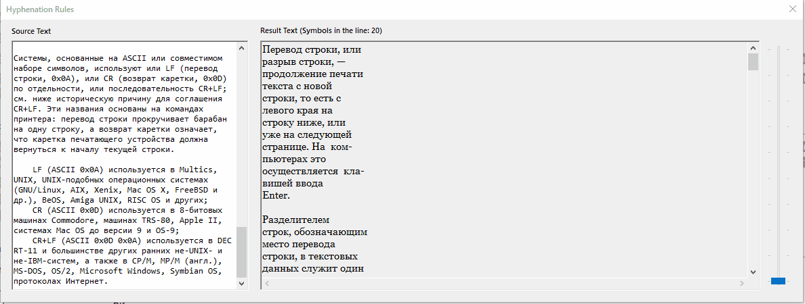
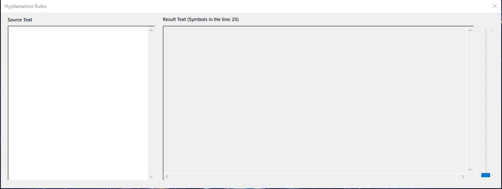
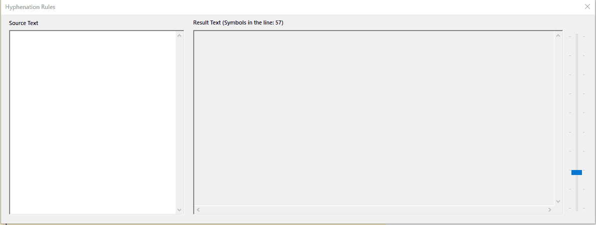

# Hyphenation Rules in C++/CLR (Windows Forms Visual C++) #

One day some stupid guy asked me to write a program for Hyphenation Rules. Using the capabilities of the modern Internet, I did it.

## Description ##

Task: Hyphenation Rules

As numerous experiments show, dividing a Russian word into parts for the transfer from one line to another is very likely to be done correctly if you use the following simple techniques:

1. Two consecutive vowels can be separated if the first of them is preceded by a consonant and the second is followed by at least one letter (the letter `й` in this case is considered together with the preceding vowel as a whole).
2. Two consecutive consonants can be separated if the first of them is preceded by a vowel and there is at least one vowel in the part of the word that comes after the second consonant (the letters `ь`, `ъ` together with the preceding consonant are treated as one whole).
3. If you fail to apply the clauses `(1)`, `(2)`, you should try to divide the word so that the first part contains more than one letter and ends in a vowel, the second part contains at least one vowel. The probability of correct partitioning increases if we first use at least an incomplete list of prefixes containing vowels and try to distinguish such a prefix from a word first.

The text is given in Russian. Format its lines by length using word hyphenation.

## Demonstration ##

### General Demonstration ###

## License ##

[MIT](LICENSE.md)