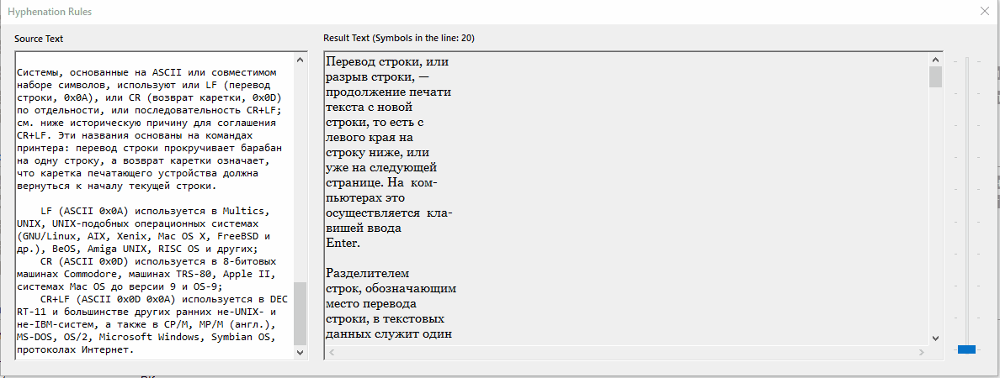
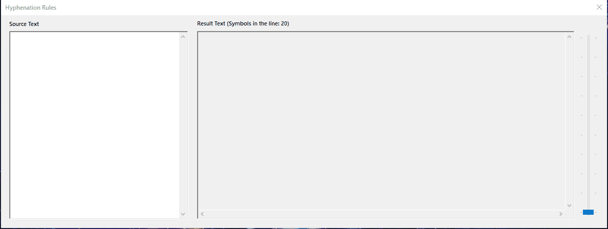
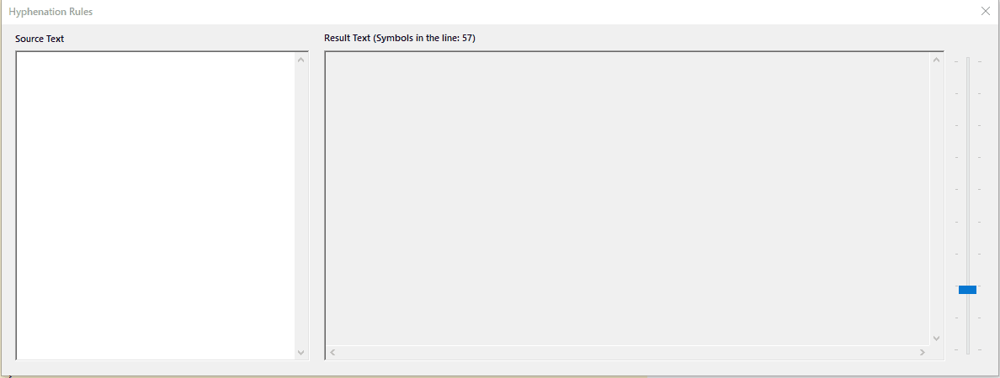

# Перенос слов на C++/CLR (Windows Forms Visual C++) #

Однажды какой-то человек попросил меня написать программу для переноса слов. Используя возможности современного Интернета, я это сделал.

## Описание ##

Задание: Перенос строк

Как показывают многочисленные эксперименты, разбиение русского слова на частидля переноса с одной строки на другую с большой вероятностью выполняются правильно,если пользоваться следующими простыми приемами:

1. Две идущие подряд гласные можно разделить, если первой из нихпредшествует согласная, а за второй идет хотя бы одна буква (буква `й` при этом рассматривается вместе с предшествующей гласной как единое целое).
2. Две идущие подряд согласные можно разделить, если первой из них предшествует гласная, а в той части слова, которая идет за второй согласной, имеется хотябы одна гласная (буквы `ь`, `ъ` вместе с предшествующей согласной рассматриваются как единое целое).
3. Если не удается применить пункты `(1)`, `(2)`, то следует попытаться разбить слово так, чтобы первая часть содержала более чем одну букву и оканчивалась на гласную, авторая содержала хотя бы одну гласную. Вероятность правильного разбиения увеличивается, если предварительно воспользоваться хотя бы неполным списком приставок, содержащих гласные, и попытаться прежде всего выделить из слова такую приставку.

Дан текст на русском языке. Выполнить форматирование его строк по длине спомощью на переноса слов.

## Демонстрация ##

### Общая демонстрация работы программы ###

## Лицензия ##

[MIT](LICENSE.md)